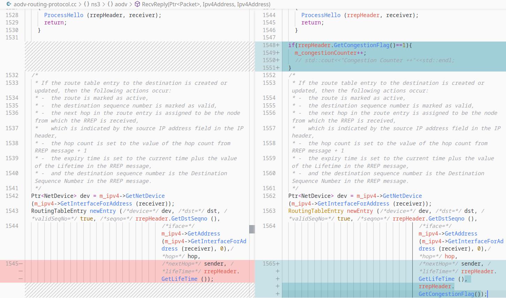

CSE 322 : Computer Networks - Project
===================================
### Project By:
Kawshik Kumar Paul\
Undergrad Student\
BUET CSE'17\
kawshik.kumar.paul@gmail.com\
https://kawshikbuet17.github.io
### Supervised By:
Md. Tareq Mahmood\
Lecturer\
Dept of CSE, BUET

Network Topologies Under Simulation
===================================

Topology for Task A - Wired
---------------------------

A wired topology is used which is look alike Fig
[3](#fig:task_a_wired){reference-type="ref"
reference="fig:task_a_wired"} which is built with two LAN networks and a
Point to Point network connecting the two LANs.\
Packet is sent from one LAN network to another LAN network in
simulation.

{#fig:task_a_wired}

. [\[fig:task\_a\_wired\]]{#fig:task_a_wired label="fig:task_a_wired"}

Topology for Task A - Wireless Low Rate (Static)
------------------------------------------------

IEEE standard 802.15.4 intends to offer the fundamental lower network
layers of a type of wireless personal area network (WPAN) which focuses
on low-cost, low-speed ubiquitous communication between devices. Here in
this simulation, low rate wpan devices (lrwpan devices) are used.

{#fig:task_a_wired}

. [\[fig:task\_a\_wired\]]{#fig:task_a_wired label="fig:task_a_wired"}

Topology for Task B - MANET AODV
--------------------------------

MANET is a dynamic wireless network that can be formed without the need
for any pre-existing infrastructure. So, the network topology may be
changed dynamically in an unpredictable manner since nodes are free to
move.

{#fig:task_a_wired}

. [\[fig:task\_a\_wired\]]{#fig:task_a_wired label="fig:task_a_wired"}

Parameters Under Variation
==========================

Parameters for Task A - Wired
-----------------------------

In this network topology, I had to simulate a wired topology. I have
varied the following parameters,

1.  The number of nodes varied as (20, 40, 60, 80, and 100)

2.  The number of flows (10, 20, 30, 40, and 50)

3.  The number of packets per second (100, 200, 300, 400, and 500)

Parameters for Task A - Wireless Low Rate (Static)
--------------------------------------------------

In this network topology, I had to simulate a wireless low rate
(802.15.4) static network. I have varied the following parameters.

1.  The number of nodes varied as (20, 40, 60, 80, and 100)

2.  The number of flows (10, 20, 30, 40, and 50)

3.  The number of packets per second (100, 200, 300, 400, and 500)

4.  Coverage area (square coverage are varying one side as Tx\_range, 2
    x Tx\_range, 3 x Tx\_range, 4 x Tx\_range, and 5 x Tx\_range)

Parameters for Task B - MANET AODV
----------------------------------

According to my selected paper, the number of nodes and sinks are varied to make the simulation.

 Overview of the Proposed Algorithm 
==================================

MANETs are characterized by wireless mobile nodes in a network that
supports the functionality of self- configurable and independently
movable nodes. These nodes in turn can be shape as hosts or clients to
construct dynamic networks for package delivery from its source to their
respective destinations via dynamic routing path. Regarding the network
performance, routers perform a critical role of delivering the data to
the appropriate destinations. Engineers have been implementing various
routing algorithms to improve wireless network performance. Ad hoc
On-Demand Distance Vector (AODV) routing is one of the famous routing
algorithms. Tremendous amounts of research on this protocol have been
done to improve the performance. In this paper, a new control scheme,
named congestion control AODV (CC-AODV), is proposed to manage the
described routing condition. With this table entry, the package delivery
rates are significantly increased while the package drop rate is
decreased, however its implementation causes package overhead. This
paper uses NS3 (network simulator 3) for simulation.

What is AODV?
-------------

An Ad Hoc On-Demand Distance Vector (AODV) is a routing protocol
designed for wireless and mobile ad hoc networks. This protocol
establishes routes to destinations on demand and supports both unicast
and multicast routing.\

### Route Discovery

-   In AODV, the route is requested only when the source node wants to
    send data to the desired destination node. Hence, the source node
    starts to send RREQ to its neighboring nodes initiating
    communication.

-   When an intermediate node received the RREQ packets, the routing
    table adds the routing information. If the table already has the
    entry, then the routers compare the sequence number and hop count
    with the existing information in the table. If the condition passes,
    the table will update the routing information in the table.

-   After receiving RREQ, node determines whether it is the destination
    node or not. Moreover, the node can check whether it received the
    same RREQ packets with the same ID previously. As a result, if a
    node receives the same ID packets, then it determines whether it
    requires an update to the table or not.

-   Once a destination node receives a RREQ packet, it generates the
    routing reply packets (RREP). This packet unicasts back to its
    represented source node and updates the intermediate node routing
    table. Thus, AODV establishes the routing path.

### Route Maintenance

-   Once a link has failed or the connection is lost, a router error
    (RRER) packet is generated and sent to the source node, which in
    turn requests to establish the new routing path.

-   When the source node receives the RRER packets, it starts the
    flooding broadcast of RREQ packets to reinitiate the route again,
    allowing AODV to maintain the routing path.

Issues with AODV
----------------

Though sometimes intermediate nodes are too busy to transmit data
packages, yet those nodes are used since they are on the shortest path
of communication. Nonetheless, when using this approach other nodes that
are available are not fully utilized even if they might have low
traffic, leading to a lack of bandwidth utilization. As a result, the
performance is degraded as the delays in delivering packets increase as
well as the number of packets delivered is reduced.

Proposed CC-AODV Mechanism
--------------------------

To overcome the challenge of AODV, the congestion control CC-ADOV is
proposed.

-   The proposed CC-ADOV aims to lower the performance degradation
    caused by the packets congestion while the data is delivered using
    AODV.

-   CC-AODV determines a path for the data by using the congestion
    counter label. This is achieved by checking how stressed the current
    node is in a table, and once the RREP package is generated and
    transmitted through the nodes, the congestion counter adds one to
    the counter.

-   The process of CC-AODV flow chart explains how to establish the
    route in Fig [4](#fig:cc-aodv-algo){reference-type="ref"
    reference="fig:cc-aodv-algo"}.

### Flowchart

{#fig:cc-aodv-algo}

. [\[fig:cc-aodv-algo\]]{#fig:cc-aodv-algo label="fig:cc-aodv-algo"}

### Algorithm

-   First, the source node performs a flooding broadcast RREQ package in
    the entire network.

-   When RREQ package arrives to the intermediate node, the router
    checks the congestion counter whether it is less than a certain
    predetermined value.

-   If the comparison yields less than the counter, the routing table
    updates and forwarding to next router; otherwise, the router drops
    the RREQ package.

-   Once the RREQ arrives to the corresponding destination, the RREP is
    generated by the router. In CC-AODV, the congestion flag is added to
    the RREP header.

-   There are two cases of which a RREP is generated corresponding to a
    RREQ. One is from the source node to establish the route and the
    other is from the neighbor nodes to maintain the route.

-   When the destination node receives the RREQ from the source node, it
    generates the RREP with the congestion flag set to true. While the
    RREP unicast back to the corresponding source node, passing by the
    intermediate node, the router checks the congestion flag. If it is
    true, the counter increases; otherwise, the counter keeps the same.
    Then, the router updates the routing information.

### Implementation Guideline

-   A 32-bits congestion control flag needs to be added to the RREP
    header shown in Fig [5](#fig:rrep-header){reference-type="ref"
    reference="fig:rrep-header"}

-   Once the table is initialized, the congestion counter is generated
    and initialized to 0.

-   Once the node receives the RREP package, the router checks the
    congestion flag, if the flag is true, then the counter is
    incremented by 1, otherwise the counter does not change.

-   There is one entry in the table called life time. When the life time
    expires, the counter subtracts 1.

-   When a node sends the RRER package back to the source node, the
    intermediate path between the source node and the destination node
    is broken from this node. Thus, the counter with this node is
    subtracted by 1.

-   When the node is removed from the network, the congestion counter
    resets to 0.

{#fig:rrep-header}

. [\[fig:rrep-header\]]{#fig:rrep-header label="fig:rrep-header"}

Modifications Made in the Simulator
===================================

For this project, ns-3 network simulator is used and the version of this
network simulator is ns-3.35\
Modifications are made in 'src/aodv/model' folder. These are the files
where AODV models are implemented.

Add Congestion Flag in RREP Packet Header
-----------------------------------------

Congestion Flag in RoutingTableEntry
------------------------------------

Add Congestion Counter and Max Count
------------------------------------

Drop RREQ Counter Greater than Max Count
----------------------------------------

Counter Increment or Decrement and Flag Operations
--------------------------------------------------

Paper Result vs Result of My Task B
===================================

Plot Graph
----------

My Observation about the Result
-------------------------------

-   Here we can see that the packet loss graph almost followed the one
    of the paper. But basic AODV and CC-AODV are nearly same. Not much
    difference.

-   We can notice a significant difference in the throughput graph.
    Throughput is significantly increased.

-   End to End delay is greater in CC-AODV than basic AODV in both paper
    simulation and my simulation. In my simulation I have measured the
    average End to End delay, so the values are not matching with the
    numeric value range with the paper simulation.

-   Packet delivery ratio didn't follow the paper very much, but if we
    look closely, when the number of nodes are near 30, the result are
    somewhat very near.

-   In CC-AODV, there is a counter whose value determines whether RREQ
    packet is sent or dropped. A congestion counter level is used here.
    I have experimented with some congestion counter level values. I
    have observed that the congestion counter value influences the
    packet delivery rate or throughput rate or others. If flow is near
    30, and the counter level is set near 4, the result is better than
    the basic AODV. Increasing the level from 4 to higher will make the
    result of CC-AODV like the basic AODV. But if the value is lesser
    than 4, it will not come out with good result. So the tuning is very
    important here to increase the packet delivery rate or throughput
    rate or others.

Minor Improvement Suggestion from my side
-----------------------------------------

In this paper, they suggested to add a flag in RREP packet header. The
flag is only to set true or false, nothing else. But they took a 32 bit
flag unnecessarily which is a waste of memory. A boolean variable can be
used here. It can be improved.

Results For Task A - Wired Topology
===================================

Plot Graph
----------
[See Plot graphs from here](03-Project-Final-Submission/Task_A/TaskA_Wired/TaskA_Wired_Plot/TaskA_Wired_Plot.pdf)

My Observation about the Result
-------------------------------

### Variation of Number of Nodes

-   Increasing the number of nodes causes an increase in the probability
    that the packet may be dropped while it competes to access the
    wireless channel at each node to reach its destination.

-   End to end delay increases with the number of nodes as to go to
    nodes which is far, it costs time.

-   Number of nodes increases definitely increases the delivery ratio as
    number of sink increases. So packet loss ratio decreases.

### Variation of Number of Flows

-   Increasing number of flows will make race conditions between
    packets, so throughput may go down. But not always race condition
    happens.

-   Increasing number of flows will make go a flow to far away nodes, it
    will increase the end to end delay.

-   Number of flows to make many packets drop. So packet delivery ratio
    will decrease and packet drop ratio will increase.

### Variation of Number of Packets Per Second

-   The increasing in throughput for larger packets is faster than the
    increasing for smaller ones. It should increase. But flowmonitor
    didn't generate good plot this time.

-   Increasing packets per second should decrease the end to end delay.

-   Increasing number of packets per second don't results in good graphs
    because there are many more parameters which are dependent with
    packets per second. So packet delivery ratio, packet drop ratio
    didn't well simulated here.

Results For Task A - Wireless Low Rate (Static)
===============================================

Plot Graph
----------
[See Plot graphs from here](03-Project-Final-Submission/Task_A/TaskA_Wireless_LowRate/TaskA_Wireless_LowRate_Plot/TaskA_Wireless_LowRate_Plot.pdf)

My Observation about the Result
-------------------------------

### Variation of Number of Nodes

-   Increasing the number of nodes causes an increase in the probability
    that the packet may be dropped while it competes to access the
    wireless channel at each node to reach its destination.

-   End to end delay should be less with the increasing number of nodes.
    But this is here low rate, so may not behave well due to low rate.
    Delay may be increased.

-   If it were wired, packet delivery ratio would be high with the
    number of nodes. But here in low rate, packet may not be delivered
    due to low rate. Packet loss ratio is vice versa.

### Variation of Number of Flows

-   Increasing number of flows make many packets to drop, so throughput
    goes down.

-   End to end delay increases with the number of flows.

-   Packet delivery ratio should increase with the number of flows. But
    due to low rate, it may misbehave.

### Variation of Number of Packets Per Second

-   Throughput increases with the number of packets per second.

-   End to end delay decreases with the number of packets per second.

-   Packet delivery ratio increases with the number of packets per
    second. Loss ratio is vice versa.

### Variation of Tx Range

-   Increasing TX range makes a packet to travel more distance. So
    throughput increases, packet delivery ratio increases, packet drop
    ratio decreases.

-   End to end delay increases as the packet can travel more distance.

Conclusion
==========

This project introduced us with NS-3. It is one of the leading network
simulating tool. It was difficult to work with for the first time, but
with the co-operations of peers and supervisors, NS3 experience has gone
well. Hope to work on computer networks in future.\
Source codes of this project is available in my Github Repository.
<https://github.com/kawshikbuet17/Congestion-Control-AODV>

References
==========
CC-ADOV: An effective multiple paths congestion control AODV\
Yefa Mai, Fernando Molina Rodriguez, Nan Wang,\
<https://ieeexplore.ieee.org/document/8301758>
